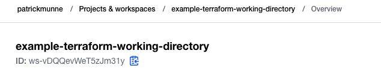
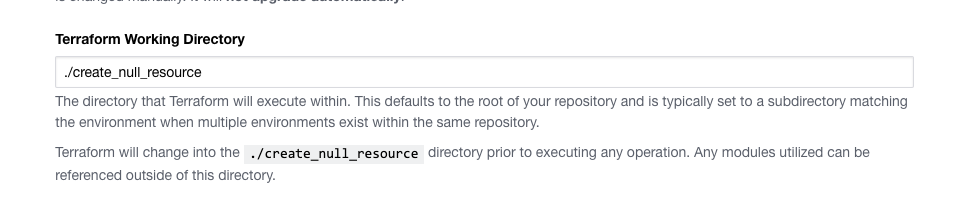
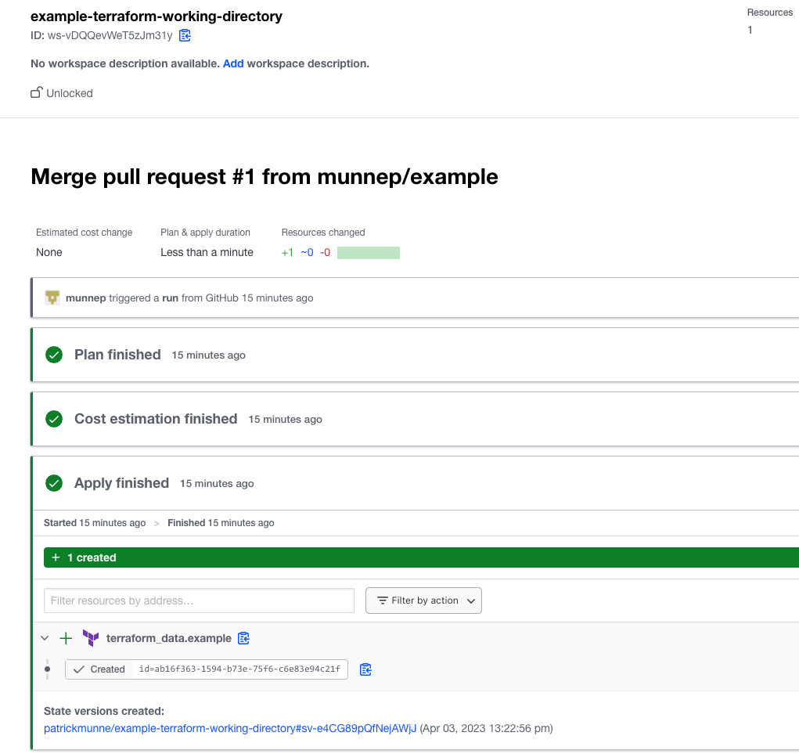

# Example: terraform working directory

This repository shows an example on how to create a workspace which executes terraform on a custom directory.

- We will create a workspace that points to this repository and a working directory
- We will execute a run from this custom working directory to create a null resource

# Prerequisites

## Install terraform  
See the following documentation [How to install Terraform](https://learn.hashicorp.com/tutorials/terraform/install-cli)

# How to

- Fork the repository to your own environment
- Clone the forked repository to your local machine
```
git clone https://github.com/munnep/terraform_working_directory.git
```
- Change your directory
```
cd terraform_working_directory/create_workspace
```
- Crate a file called `terraform.auto.tfvars` with the following content
```
organization_name = "patrickmunne"                      # organization name within Terraform Cloud
vcs_repo = "munnep/terraform_working_directory"         # name of your vcs repository
vcs_oauth_token_id = "ot-sDcTZi4a9mAAAPP"               # the oauth_token configured in Terraform Cloud to access the former repository
```
- Terraform initialize
```
terraform init
```
- Terraform plan
```
terraform plan
```
- Terraform apply
```
terraform apply
```
- Sample output
```
tfe_workspace.test: Creating...
tfe_workspace.test: Creation complete after 1s [id=ws-vDQQevWeT5zJm31y]

Apply complete! Resources: 1 added, 0 changed, 0 destroyed.
```
- Within Terraform Cloud you should now have a workspace named `example-terraform-working-directory`

  

- Under the `General Settings` of the workspace you should see where terraform executes the code from
  
- It should have reached out to the repository configured and do a run
  
